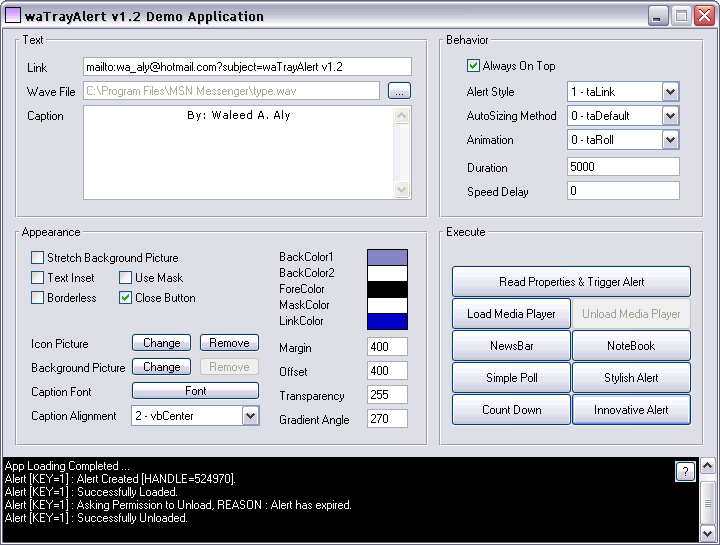



## waTrayAlert v1\.2

### Description

I was inspired by Clint's vcTrayAlert Control at http://vbasic.iscool.net/ It was cool but he did not make the source code available. So I decided to write my very own control. Along the way I have added many cool features. I have used a gradient-drawing class that I found on PSC by Kath-Rock. I made a help file for my control and as you will easily figure out, I have invested alot of my spare time into this large project. It is made free but make sure to check out the license agreement and copyright info. All I'd like to ask you is your encouragement - IF you DO like my control. So I'll be waiting for your feedbacks and emails :) Oh, I'd like to ask you for one more thing. Help me debug this control, report any bugs you might find to me on my email addres. Thanx. KEYWORDS: MSN Style Tray Alert Control, ActiveX Control, User Control, Play WAVE WAV File Resource, Always On Top, Top Most, Transparency, Transparent, Fade, Mask, Borders, Gradient, Error Handling.
 
### More Info
 

             |
---                |---
**Submitted On**   |2003-08-21 19:32:04
**By**             |[Waleed A\. Aly](https://github.com/Planet-Source-Code/PSCIndex/blob/master/ByAuthor/waleed-a-aly.md)
**Level**          |Advanced
**User Rating**    |4.8 (24 globes from 5 users)
**Compatibility**  |VB 5\.0, VB 6\.0
**Category**       |[OLE/ COM/ DCOM/ Active\-X](https://github.com/Planet-Source-Code/PSCIndex/blob/master/ByCategory/ole-com-dcom-active-x__1-29.md)
**World**          |[Visual Basic](https://github.com/Planet-Source-Code/PSCIndex/blob/master/ByWorld/visual-basic.md)
**Archive File**   |[waTrayAler1633618222003\.zip](https://github.com/Planet-Source-Code/waleed-a-aly-watrayalert-v1-2__1-47905/archive/master.zip)

